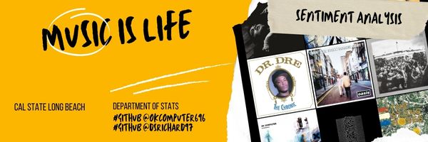

<!-- center banner -->

  

<h1 align="center">Musical Artist Sentiment Analysis</h1>

<!-- badges -->

  
  
  
  
  
  
  

<!-- Authors -->

  <h2>Authors</h2>
  <ul>
    <li><a href="https://github.com/dsrichard97">@dsrichard97</a></li>
    <li><a href="https://github.com/OKcomputer626">@OKcomputer626</a></li>

  </ul>

<!-- Table of Contents -->

  <h2>Table of Contents</h2>
  <ul>
    <li><a href="#how-to" target="_parent">Getting Started</a></li>
    <li><a href="#data-source">Data Source</a></li>
    <li><a href="#glance">Quick Glance</a></li>
    <li><a href="#steps">Steps</a></li>
    <li><a href="#motivation">End Goal</a></li>

  </ul>

<!-- Getting started -->

  <section id="how-to">
    <h2>Getting Started</h2>
    

    The focus of this project will be on Sentiment Analysis. The hope to guide preliminary EDA.
    

  
  <h3>Library Installation</h3>
    

    Ensure you have R and RStudio installed on your computer. RStudio provides an integrated development environment (IDE) that makes coding in R easier. Or Posit Cloud
    

  </section>

<!-- Data Source -->

  <section id="data-source">
    <h2>Data Source</h2>
    

      Data was extracted using a Token API using spotify access. For further replication on the use of an Spotify API: <li><a href="https://developer.spotify.com/documentation/web-api">Click here</a></li>
    

  </section>

<!-- Quick Glance at Results-->

  <section id="glance">
    <h2>Quick Glance</h2>
    

      Data was extracted using a Token API using spotify access. For further replication on the use of an Spotify API: <li><a href="https://developer.spotify.com/documentation/web-api">Click here</a></li>
    

  </section>

  

  

<!-- Steps-->

  <section id="steps">
    <h2>Steps</h2>
    <h2>Step 1: Setting Up Your Environment</h2>

Install R and RStudio. Use RStudio's IDE for ease of development.

Install required libraries with the command:

<pre>
    <code>install.packages(c("tidyverse", "tidytext", "ggwordcloud", "ggtext", "showtext", "gt"))</code>
</pre>

<h2>Step 2: Load the Libraries</h2>

Load the necessary libraries in R:

<pre>
    <code>
library(tidyverse)
library(tidytext)
library(ggwordcloud)
library(ggtext)
library(showtext)
library(gt)
    </code>
</pre>

<h2>Step 3: Getting and Preparing Your Data</h2>
<ul>
    <li>Choose your data source, focusing on the musical artist and songs for analysis.</li>
    <li>Load your data with <code>read_csv("path/to/your/data.csv")</code>.</li>
    <li>Clean your data to prepare it for analysis.</li>
</ul>

<h2>Step 4: Text Processing</h2>

Tokenize the lyrics into individual words using <code>tidytext::unnest_tokens()</code> and filter out common stop words.

<h2>Step 5: Sentiment Analysis</h2>

Choose a sentiment lexicon and match words to sentiments. Example:

<pre>
    <code>
bing_sentiments &lt;- tidy_df %>%
  inner_join(get_sentiments("bing")) %>%
  count(word, sentiment, sort = TRUE)
    </code>
</pre>

<h2>Step 6: Visualization and Interpretation</h2>
<ul>
    <li>Visualize common words with word clouds.</li>
    <li>Plot frequency of sentiments with ggplot2.</li>
    <li>Analyze results for trends in sentiment.</li>
</ul>

<h2>Step 7: Share Your Findings</h2>

Compile your analysis into a report using Quattro or R markdown. Share on Github. Use as a project for resume.

</body>
  </section>

  

<!-- Quick Glance at Results-->

  <section id="motivation">
    <h2>End Goal</h2>
    

      This project aims to inspire both students and data science enthusiasts to undertake their own projects, with the aspiration that through continued practice, they'll gain a deeper appreciation for the boundless creativity and narrative potential inherent in data and visualizations. For more insights and inspiration, consider exploring Andres's Medium post on the sentiment analysis of The Smiths, a quintessential English band that dominated the 80s: https://medium.com/@gonzalez_afc/sentiment-analysis-of-the-the-smiths-a-quintessential-english-band-that-ruled-the-80s-173266b1d697 </a></li>
    

  </section>

